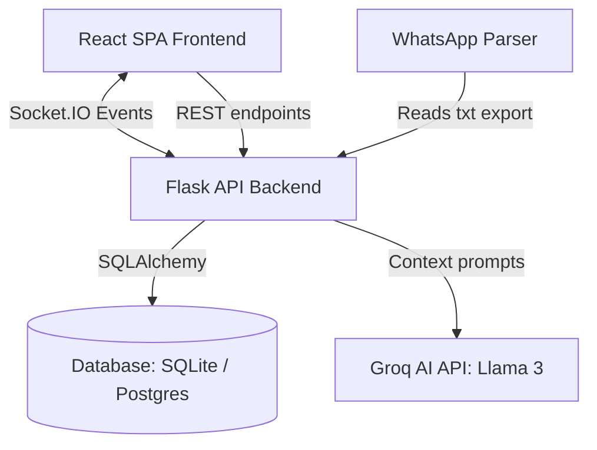

# 🤖 Mimic AI — Digital Twin Messenger

> **Hackathon Track 1 Challenge: Build Your Own Digital Clone**
>
> A next-generation messaging web application that learns your language style, slang, tone, and emoji usage from your exported WhatsApp chat history and replies on your behalf when you are offline.

---

## 🌟 Key Features

- **Real-Time Messaging**: Bi-directional chat with instant text delivery using Flask-SocketIO.
- **Online Presence & Typing States**: Live status indicators (online/offline/last seen) and active typing indicators.
- **AI Stand-In Clone (Mimicry)**: When you go offline, our custom AI chatbot clone takes over. It auto-replies to incoming messages in your voice, tone, and language style (e.g., matching Hinglish, punctuation habits, or all-lowercase typing).
- **WhatsApp Chat Parser**: Upload your standard `.txt` WhatsApp chat exports to feed the AI clone few-shot tone examples.
- **Vibrant Modern Dashboard**: Sleek dark-mode visual interface with clean transitions, glassmorphism, responsive sidebar toggle, and custom toast notifications.
- **SQLAlchemy DB Connection**: Zero-configuration sqlite local database that seamlessly upgrades to production-grade PostgreSQL (e.g., Render Postgres).

---

## 📐 Architecture Overview



---

## 🛠️ Tech Stack

- **Frontend**: React 18, Vite, React Router, TailwindCSS/Vanilla CSS, Lucide Icons, Socket.IO Client.
- **Backend**: Python, Flask, Flask-CORS, Flask-SocketIO, Eventlet (asynchronous networking), SQLAlchemy Core (ORM/DB connection).
- **LLM Engine**: Groq SDK running `llama-3.3-70b-versatile`.
- **Database**: SQLite (Local Dev) / PostgreSQL (Production).

---

## 🚀 Local Installation & Setup

Follow these steps to run **Mimic AI** locally:

### 1. Clone & Navigate
```bash
git clone https://github.com/jaydipvaliya/crud_crew.git
cd crud_crew/Mimic-AI
```

### 2. Backend Setup
1. **Initialize Virtual Environment**:
   ```bash
   cd backend
   python -m venv venv
   # On Windows:
   .\venv\Scripts\activate
   # On macOS/Linux:
   source venv/bin/activate
   ```
2. **Install Dependencies**:
   ```bash
   pip install -r requirements.txt
   ```
3. **Configure Environment**:
   Create a `.env` file inside the `backend/` folder:
   ```env
   SECRET_KEY=your-super-secret-key
   GROQ_API_KEY=your_groq_api_key_here
   GROQ_MODEL=llama-3.3-70b-versatile
   PORT=5000
   FLASK_DEBUG=true
   ```
4. **Run Smoke Tests**:
   Ensure database operations and configuration are functional:
   ```bash
   python smoke_test.py
   ```
5. **Start Flask Server**:
   ```bash
   python app.py
   ```

### 3. Frontend Setup
1. **Navigate & Install**:
   In a new terminal window:
   ```bash
   cd Mimic-AI/frontend
   npm install
   ```
2. **Start Dev Server**:
   ```bash
   npm run dev
   ```
   Open `http://localhost:5173` in your browser.

---

## 🦾 How AI Mimicry Works

1. **Upload Chat Export**:
   Go to `/chat`, click the **Upload Cloud** button, and select a `.txt` WhatsApp chat export file containing messages between you and a contact.
2. **Context Engine**:
   - The backend parses the conversation, isolates your messages, and maps them to incoming prompts.
   - It extracts the top 20 message pairs to serve as few-shot LLM examples.
3. **Stand-In Mode**:
   - Enable your AI Stand-In toggle.
   - When another user sends you a message while you are logged out (offline), the Socket.IO server retrieves your few-shot style examples.
   - It injects them into a system prompt enforcing your name, abbreviation preferences, language mixes, and format constraints, prompting the Groq LLM to generate the perfect mimic reply.

---

## 🌍 Production Deployment

### Backend (e.g., Render)
- Configure the environment variables `DATABASE_URL` (for PostgreSQL integration) and `GROQ_API_KEY`.
- Ensure the start command uses eventlet:
  ```bash
  gunicorn --worker-class eventlet -w 1 --timeout 120 app:app
  ```
- If deploying cross-origin, configure `FRONTEND_URL` in backend env variables to allow CORS.

### Frontend (e.g., Vercel)
- Make sure `frontend/src/api.js` points to the correct Render backend domain.
- Build the app:
  ```bash
  npm run build
  ```

---

## 🛡️ Responsible Use Guidelines
This application operates on personal conversation data.
- **Privacy First**: Files uploaded are parsed locally, mapped directly to database records, and never shared with third parties.
- **Consent**: Ensure you only train your AI clone on conversations where you have the consent of the other participant.
- **Indication**: AI-generated responses are flagged with a `🤖 AI` badge in the interface to distinguish them from manual messages.